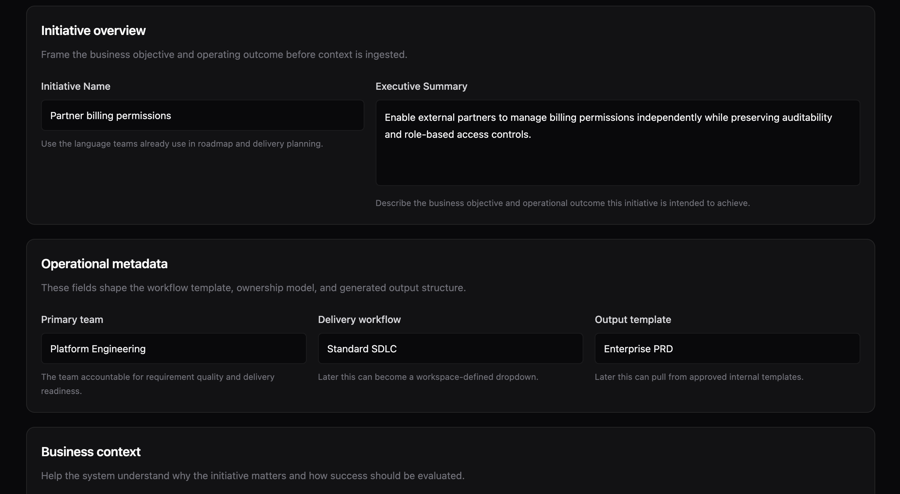
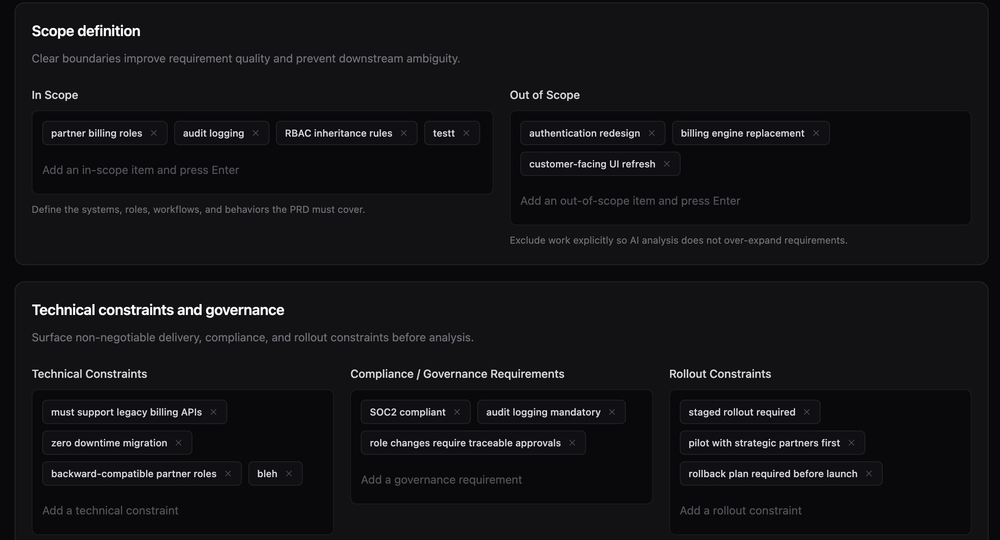
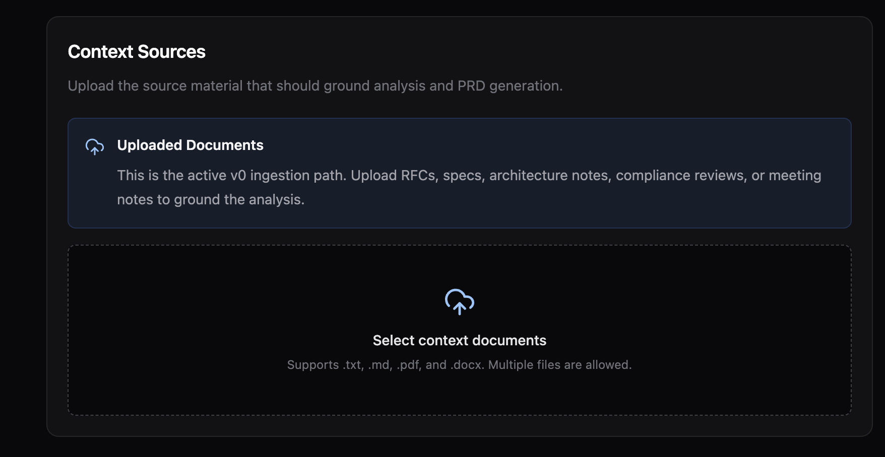
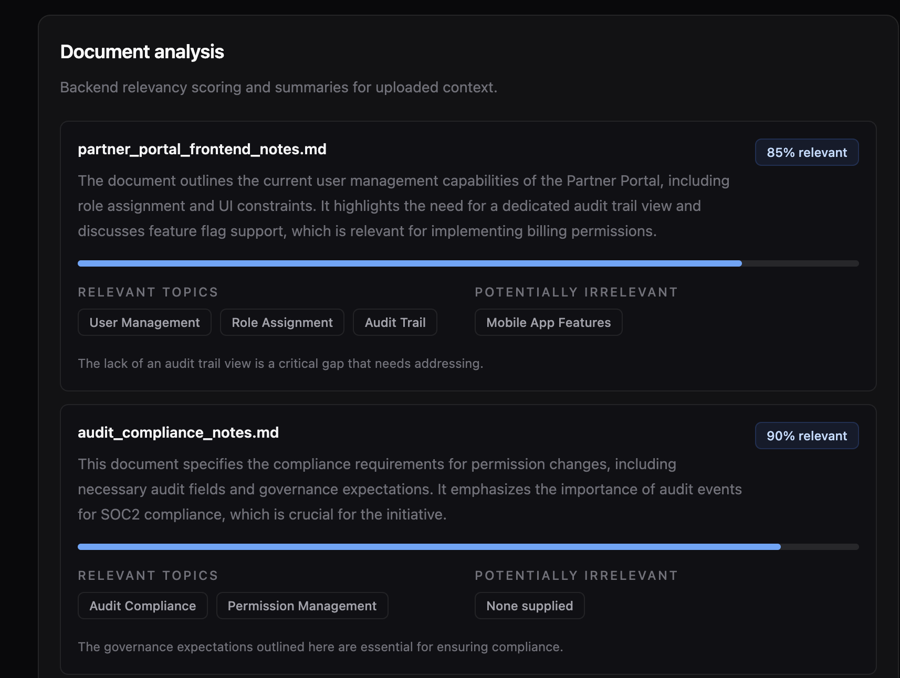
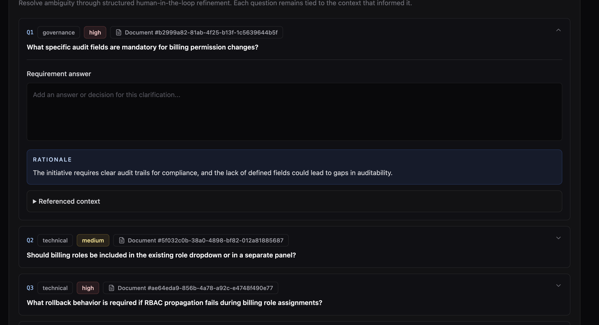
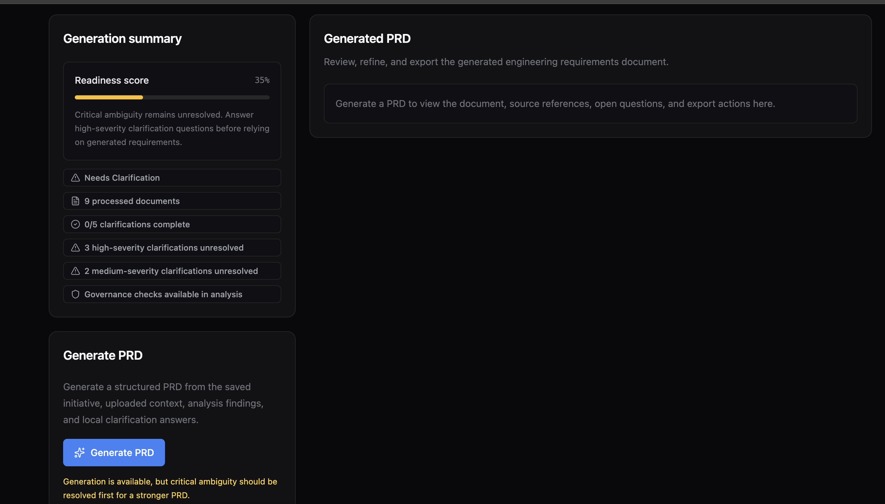
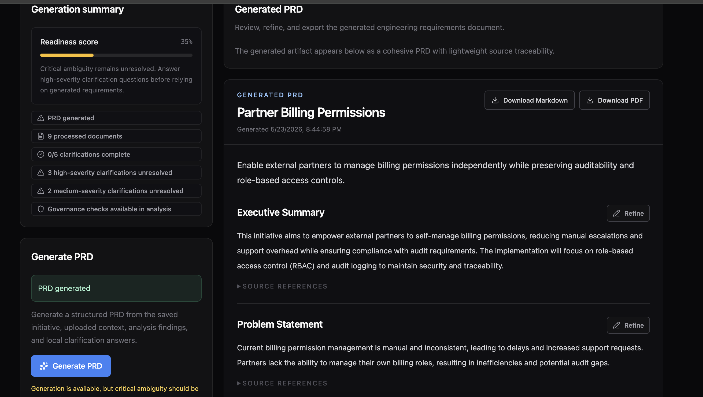

# ContextPRD

ContextPRD is an AI-assisted engineering workflow application that transforms initiative definitions and uploaded project context into traceable, implementation-oriented product requirement documents.

It is designed as a portfolio-quality prototype of a realistic internal SDLC tool: define an initiative, upload relevant context, run AI analysis, resolve ambiguity through clarification questions, generate a grounded PRD, refine individual sections, and export the result as Markdown or PDF.

## Overview

Engineering teams often start planning from fragmented context: partially current specs, architecture notes, compliance reviews, meeting notes, rollout constraints, and ambiguous product intent. The result is often a PRD that looks complete but still leaves engineering, QA, and governance teams with unresolved implementation questions.

ContextPRD focuses on the workflow around requirement quality rather than simple AI text generation. It uses structured initiative intake, uploaded documents, AI-assisted context analysis, clarification loops, and source-aware PRD synthesis to create a more credible engineering artifact.

The application helps teams:

- Frame initiatives with business context, scope, constraints, and success metrics.
- Upload project documents that should ground downstream analysis.
- Identify relevant and irrelevant context before generation.
- Surface gaps, risks, dependencies, and implementation-driving questions.
- Generate a traceable PRD that preserves source references.
- Refine individual PRD sections without regenerating the entire document.
- Export the final artifact as Markdown or PDF.

## Screenshots

| Initiative definition | Scope and governance |
| --- | --- |
|  |  |

| Context upload | AI document analysis |
| --- | --- |
|  |  |

| Clarification workflow | Generation readiness |
| --- | --- |
|  |  |

| Generated PRD |
| --- |
|  |

## Core Workflow

1. **Define Initiative**  
   Capture the initiative name, executive summary, business context, scope, technical constraints, governance requirements, rollout constraints, and success metrics.

2. **Upload Context Documents**  
   Add supporting project context such as RFCs, specs, architecture notes, security reviews, or meeting notes. The current implementation supports `.txt`, `.md`, `.pdf`, and `.docx` extraction.

3. **AI Analysis**  
   Analyze the initiative and uploaded documents to produce relevance scoring, document summaries, irrelevant context, requirement gaps, risks, inferred dependencies, and clarification questions.

4. **Clarification Questions**  
   Resolve high-value implementation ambiguity through structured human-in-the-loop answers. These answers are persisted and used during PRD generation.

5. **Traceable PRD Generation**  
   Generate a structured PRD with sections for goals, requirements, non-functional requirements, technical considerations, risks, rollout planning, success metrics, and open questions.

6. **Human-in-the-loop Refinement**  
   Refine individual PRD sections with targeted instructions, while preserving surrounding document context and source references.

7. **Export Markdown/PDF**  
   Export the latest generated and refined PRD as a readable engineering artifact.

## Features

- AI-assisted initiative and document analysis
- Document relevance scoring on a normalized 0-1 scale
- Irrelevant context detection
- Gap, risk, dependency, and governance signal extraction
- Implementation-focused clarification question generation
- Persisted clarification answers
- Structured PRD generation with source references
- Section-level PRD refinement
- Markdown and PDF export
- Supabase Auth for authenticated access
- Neon Postgres persistence through Drizzle ORM
- Focused Vitest coverage for workflow logic and API behavior

## Architecture

ContextPRD uses the Next.js App Router as both the frontend application and backend API surface. API routes coordinate validation, authentication, persistence, document processing, and AI orchestration.

```text
Next.js UI
  |
  v
App Router API Routes
  |
  +--> Supabase Auth
  |
  +--> Document Extraction
  |
  +--> OpenAI Analysis / PRD Generation
  |
  v
Neon Postgres
  |
  v
Drizzle ORM
```

The implementation intentionally keeps the architecture lightweight:

- API routes validate payloads with Zod.
- Service modules isolate persistence, document processing, analysis, PRD generation, and refinement.
- Drizzle schema and migrations define the database shape.
- AI prompts return structured JSON that is validated before use.
- Generated PRDs remain structured data, powering UI rendering, Markdown export, and PDF export.

## Tech Stack

**Frontend**

- Next.js App Router
- React
- TypeScript
- Tailwind CSS
- Lucide React icons

**Backend**

- Next.js API Routes
- OpenAI Node SDK
- Zod validation
- Lightweight document extraction for `.txt`, `.md`, `.pdf`, and `.docx`

**Persistence**

- Neon Postgres
- Drizzle ORM
- Drizzle Kit migrations

**Authentication**

- Supabase Auth
- `@supabase/ssr` cookie-based server/browser clients

**Testing**

- Vitest
- Focused unit and integration-style tests for workflow logic, hydration mapping, PRD export, clarification persistence, and API behavior

## Local Development

### 1. Install dependencies

```bash
npm install
```

### 2. Configure environment variables

Create `.env.local`:

```bash
NEXT_PUBLIC_SUPABASE_URL=
NEXT_PUBLIC_SUPABASE_PUBLISHABLE_KEY=
DATABASE_URL=

# Optional. If omitted, AI routes use realistic mock fallbacks where supported.
OPENAI_API_KEY=
DEFAULT_OPENAI_MODEL=gpt-4.1-nano
```

### 3. Set up Supabase Auth

Create a Supabase project and copy the project URL and publishable key into `.env.local`.

Only Supabase Auth is used. Application workflow data is stored in Neon Postgres, not Supabase database tables.

### 4. Set up Neon Postgres

Create a Neon database and add the connection string as `DATABASE_URL`.

Generate and apply Drizzle migrations:

```bash
npm run db:generate
npm run db:migrate
```

Open Drizzle Studio if you want to inspect persisted workflow data:

```bash
npm run db:studio
```

### 5. Run the app

```bash
npm run dev
```

Open [http://localhost:3000](http://localhost:3000).

## Scripts

```bash
npm run dev           # Start the local Next.js dev server
npm run build         # Create a production build
npm run typecheck     # Run TypeScript checks
npm run test          # Run Vitest tests
npm run test:watch    # Run Vitest in watch mode
npm run test:coverage # Run tests with coverage output
npm run db:generate   # Generate Drizzle migrations
npm run db:migrate    # Apply Drizzle migrations
npm run db:studio     # Open Drizzle Studio
```

## Testing

The test suite is intentionally focused rather than exhaustive. It covers the core workflow logic that would be most expensive to regress:

- Readiness score behavior and readiness states
- PRD Markdown export structure
- Refined PRD section replacement
- Initiative JSONB hydration and camelCase mapping
- Clarification answer upsert/retrieval behavior
- API auth, invalid ID, and validation handling
- AI analysis reference normalization for numeric model outputs

Run:

```bash
npm run test
npm run test:coverage
```

## Project Scope

ContextPRD is a portfolio prototype, not a production SaaS platform. It intentionally avoids heavier infrastructure such as background jobs, vector databases, embeddings, multi-tenant org management, billing, connector OAuth flows, and collaborative editing.

The focus is the core AI-assisted workflow:

```text
Initiative Definition
  -> Context Upload
  -> AI Analysis
  -> Clarification
  -> PRD Generation
  -> Section Refinement
  -> Export
```

## Why This Project Exists

ContextPRD demonstrates how AI can be embedded into an enterprise engineering workflow without becoming a generic chat interface. The emphasis is on structured inputs, grounded analysis, traceable outputs, and human review points that improve implementation readiness.

It is meant to show practical full-stack product engineering across UI design, backend API design, auth, persistence, AI orchestration, validation, document processing, and testing.
